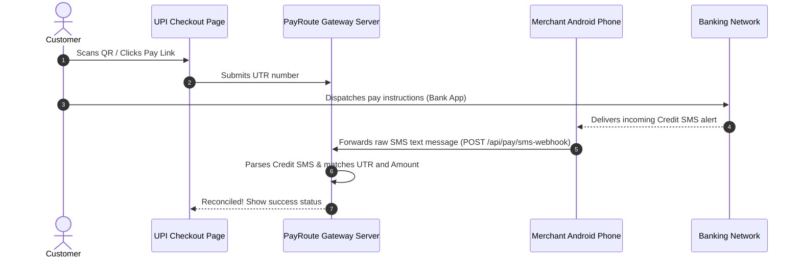

# ⚡ UPI PayRoute - SaaS P2P Payment Gateway

A high-performance, multi-tenant P2P UPI Payment Gateway designed for digital merchants, developers, and Shopify store owners. UPI PayRoute enables zero-fee payment processing by dynamically routing customer checkouts across a pool of personal UPI Virtual Payment Addresses (VPAs) and auto-reconciling payments by matching incoming mobile SMS alerts.

---

## 🚀 Key Features

*   **Zero Transaction Fees (P2P Routing)**: Payments route directly from your customer's bank account to your merchant bank account via standard UPI deep links and QR codes.
*   **Dynamic VPA Pool Rotation**: Distributes incoming transactions across a customizable pool of active UPI IDs. Automatically tracks transaction volume limits and frequency constraints to avoid bank limits, and places individual accounts in cool-down modes dynamically.
*   **Automated SMS-Based Reconciliation**: Reconciles orders automatically using incoming mobile SMS alerts from standard banking applications (SBI, HDFC, Axis, ICICI, etc.) forwarded from an Android phone. No formal corporate bank APIs or merchant accounts required.
*   **Shopify Integration**: Seamlessly marks Shopify orders as "PAID" instantly when matching transaction credits are received.
*   **Custom Business Branding**: Configurable checkout themes, custom brand logos, accent colors, and custom shop payee names showing your business name on UPI apps instead of personal names.
*   **Live Webhook Pings & Pulsing Badge**: Real-time connection status indicators for all configured forwarder gateways. Pulsing neon green status dots for active nodes, red indicators for idle ones, and action buttons to test connection pathways immediately.
*   **Developer API & Simulator**: Dynamic REST endpoint developer documentation, automated outgoing webhook delivery history retries, and an interactive SMS webhook mock parser tool.

---

## 🛠️ System Architecture & Workflow

### The 4-Step Payment Lifecycle



1.  **Initiation**: The customer accesses the custom, glassmorphic checkout page generated by your store/API, showing the dynamic VPA assigned by rotation logic.
2.  **Payment & UTR Submission**: Customer transfers funds directly using any UPI app (GPay, PhonePe, Paytm) and submits the 12-digit transaction UTR reference number on the checkout screen.
3.  **SMS Capture**: The bank delivers a transaction credit SMS receipt to the merchant's SIM card registered to the UPI ID. An Android SMS Forwarder app reads the message and POSTs it to the gateway webhook receiver.
4.  **Automatic Matching**: The gateway matches the parsed SMS parameters (amount, VPA, and UTR number) against the transaction logs. Upon a successful match, the order is marked as `APPROVED` and webhooks/Shopify callbacks trigger instantly.

---

## 🗄️ Database Schema Layout

UPI PayRoute utilizes PostgreSQL to manage multi-tenant settings, transaction ledgers, active routing pools, and audit trails.

```
                  +-------------------+
                  |       users       | <---+ (1-to-Many Owner relationship)
                  +-------------------+     |
                            |               |
         +------------------+---------------+------------------+
         |                  |               |                  |
+-----------------+ +----------------+ +-----------+ +-------------------+
|personal_upi_pool| |transaction_logs| |  webhook  | |sms_webhook_logs   |
+-----------------+ +----------------+ |  delivery | +-------------------+
                                       |   logs    |
                                       +-----------+
```

### 1. `users`
Manages portal authorization profiles, API keys, Shopify settings, settlement details, and portal configurations.
*   `id`: `SERIAL PRIMARY KEY`
*   `email`: `VARCHAR(255) UNIQUE`
*   `password_hash`: `VARCHAR(255)`
*   `api_key`: `VARCHAR(255)` (Used to authenticate merchant API requests and Android forwards)
*   `shopify_store` & `shopify_token`: Optional Shopify integration parameters
*   `gateway_url`: The merchant portal's active domain URL
*   `business_name`, `logo_url`, `checkout_primary_color`: UI customizations

### 2. `personal_upi_pool`
Stores active UPI VPA accounts allocated to rotation pools.
*   `upi_id`: `VARCHAR(255) PRIMARY KEY`
*   `user_id`: `INTEGER REFERENCES users(id)`
*   `account_holder`: Real bank account owner name
*   `daily_amount_limit`, `daily_count_limit`: Limit guardrails
*   `current_amount`, `current_count`: Daily stats
*   `is_active`: Toggle status
*   `last_ping`: Timestamp of last active gateway ping

### 3. `transaction_logs`
Central transaction ledger records.
*   `order_id`: `VARCHAR(255) PRIMARY KEY`
*   `user_id`: `INTEGER REFERENCES users(id)`
*   `base_amount`, `final_amount`: Decimals for dynamic pricing reconciliation matching
*   `assigned_upi`: VPA that received the transaction
*   `utr_number`: 12-digit UTR reference
*   `status`: `PENDING`, `APPROVED`, or `EXPIRED`

### 4. `sms_webhook_logs`
Audit trails of raw incoming texts forwarded by the Android SIM device.
*   `id`: `SERIAL PRIMARY KEY`
*   `user_id`: `INTEGER REFERENCES users(id)`
*   `assigned_upi`: Target VPA parameter
*   `raw_body`: Plain text body of the forwarded SMS
*   `processed`: Boolean status
*   `matched_order_id`: Associated Order ID outcome

---

## 📲 Android Forwarder Configuration

To automate matching, configure an **SMS Gateway / Forwarder** application on the Android phone containing the UPI-registered SIM card.

### Recommended Apps:
*   *SMS Gateway* (Free/Open Source)
*   *SmsForwarder* (GitHub MVVM project)

### Connection Parameters:
1.  **Target Endpoint URL**: Copy your unique webhook forwarding endpoint from your Dashboard's VPA pool card:
    ```
    https://<YOUR_GATEWAY_URL>/api/pay/sms-webhook/<MERCHANT_USER_ID>/<UPI_ID>?token=<YOUR_API_KEY>
    ```
2.  **HTTP Request Method**: `POST`
3.  **Payload Format**: JSON
4.  **Field Key mapping**: The forwarder must map the SMS message body text to the field named `body`, `message`, or `text` in the JSON POST payload:
    ```json
    {
      "sender": "VK-SBIUPI",
      "body": "Dear Customer, a/c linked to UPI ID merchant@sbi credited with INR 500.00 on 09-07-26 by UPI Ref 618290382903"
    }
    ```

---

## 🛠️ Local Development Setup

### Prerequisites
*   Node.js (v16+)
*   PostgreSQL

### Installation
1.  Clone the repository:
    ```bash
    git clone https://github.com/yashgupta927413-oss/UPI.git
    cd upi-payment-gateway
    ```
2.  Install dependencies:
    ```bash
    npm install
    ```
3.  Configure variables in a `.env` file:
    ```env
    PORT=3000
    DATABASE_URL=postgresql://<user>:<password>@localhost:5432/upi_gateway
    JWT_SECRET=your_jwt_secret_token
    ```
4.  Launch the application:
    ```bash
    npm start
    ```
    Access the portal at `http://localhost:3000`.

---

## 🚢 Production Deployment (Render)

This project contains a [render.yaml](file:///Users/yash/.gemini/antigravity/scratch/upi-payment-gateway/render.yaml) blueprint specification file. To deploy:

1.  Connect your GitHub repository to **Render**.
2.  Create a new Web Service using the `render.yaml` specification.
3.  Add the `DATABASE_URL` environment variable pointing to your managed PostgreSQL instance.
4.  Deploy! The setup wizard will automatically seed schemas on first boot.
